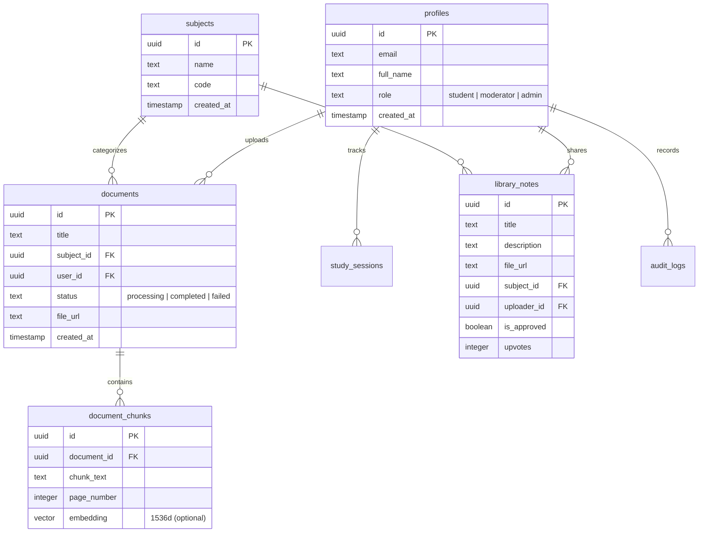

# 🎓 Studyys — AI-Powered Study Assistant for Engineering Students

**Studyys** is a premium, production-grade academic study portal designed specifically for Computer Science & Engineering (CSE) students. By uploading textbook chapters, syllabus guides, or lecture notes, students can leverage the **Google Gemini 1.5 Flash API** to get smart document explanations, auto-compile multiple-choice quizzes, study using interactive 3D flashcards, and share vetted notes in a moderated library.

---

## 🌟 Key Product Features

*   💬 **AI Academic Assistant**: Upload textbook or syllabus PDFs. Query complex formulas, code snippets, or definitions. The AI answers using contextual document chunks, displays page references, and provides a confidence rating. It automatically handles general-knowledge questions even if they fall outside the document context.
*   📝 **Dynamic 50-Question Quizzes**: Automatically compile custom exams from your study materials. Features academic difficulty levels (Easy, Medium, Hard), a timer, progress metrics, correct/incorrect highlighting, and explanation dialogues. Includes a **"Generate 50 More"** continuation prompt on completion.
*   🎴 **3D Flip Flashcards**: Practice active recall with beautiful 3D card flipping transitions. Supports document-wide topic extraction (e.g. CPU Scheduling, Memory Management, Trees, Databases) to let you study specific subjects, and lets you dynamically generate 50 more cards for the selected topic.
*   📚 **Vetted Campus Library**: Share your notes, study guides, and cheat sheets with fellow students. Includes upvoting, semester/subject filters, and a submission approval flow.
*   🛡️ **Student-Moderator Panel**: Authorized student-moderators can review library uploads, manage community roles (Student, Moderator, Admin), and track audit logs.
*   📊 **Academic Analytics**: Track study time distribution, quiz performance, and active subjects using responsive charts powered by Recharts.
*   🌓 **Global Dark Mode**: Responsive light/dark theme system that respects student preferences and reduces eye strain during late-night study sessions.

---

## 🛠️ Complete Workspace Directory Structure

The repository follows a clean, modular folder hierarchy:

```text
Studyys/
├── public/                 # Static assets (icons, logo, local copy of pdf.worker)
├── src/
│   ├── context/            # Global State Contexts
│   │   └── AuthContext.tsx # Manages Supabase Session, User Roles, and Mock Mode state
│   ├── layouts/            # Component Layouts
│   │   └── AppLayout.tsx   # Sidebar, Navbar, Dark Mode Toggle, and main layout container
│   ├── routes/             # Client-side Routing
│   │   └── ProtectedRoute.tsx # Route guards ensuring correct roles (Student, Moderator, Admin)
│   ├── services/           # Service Integrations & API Clients
│   │   ├── gemini.ts       # Gemini API client, simulator, & topic extractors
│   │   ├── pdfParser.ts    # PDF text extraction utilizing pdf.js web-workers
│   │   ├── subjects.ts     # Subject loading utilities
│   │   └── supabase.ts     # Supabase client instantiation
│   ├── pages/              # Primary Page Views
│   │   ├── auth/           # Login and Registration pages
│   │   ├── dashboard/      # Summary dashboard, statistics, & quick actions
│   │   ├── study/          # Core Study Workspaces
│   │   │   ├── AskAI.tsx   # Document-aware Chat Workspace
│   │   │   ├── Quiz.tsx    # 50-Question MCQ Practice Arena
│   │   │   └── Flashcards.tsx # Topic-focused 3D Flashcard Deck
│   │   ├── library/        # Campus Library browser & note uploader
│   │   ├── moderator/      # Review queue, audit log, & user role manager
│   │   ├── analytics/      # Recharts overview charts & session tracking
│   │   ├── profile/        # User account details and activity history
│   │   └── NotFound.tsx    # 404 handler page
│   ├── App.tsx             # App routing mappings & React Query integration
│   ├── main.tsx            # Main React 18 DOM entrypoint
│   └── index.css           # Core styling system (Vanilla CSS variables + utility tokens)
├── supabase_schema.sql     # PostgreSQL database layout, triggers, and RLS policies
├── DOCUMENTATION.md        # Technical architectural design document and FAQs
├── vite.config.ts          # Vite build config with worker copying pipelines
├── tsconfig.json           # TypeScript configuration
└── README.md               # Visual repository documentation (this file)
```

---

## 🗄️ Database Architecture & Schemas

The application uses **Supabase (PostgreSQL)** for persistence. Below is a breakdown of the tables defined in `supabase_schema.sql`:



### Table Explanations:
1.  **`profiles`**: Tracks user information and their permissions (`student`, `moderator`, or `admin`). Integrates directly with Supabase `auth.users` via database triggers.
2.  **`subjects`**: Standard engineering subjects (e.g., Operating Systems, Databases, Data Structures).
3.  **`documents`**: Track uploaded PDF metadata, URLs, and extraction state.
4.  **`document_chunks`**: Stores extracted text pages/segments, mapped back to the original PDF page number for citation lookup.
5.  **`study_sessions`**: Logs student study activity, tracking study times and subjects for the dashboard stats.
6.  **`library_notes`**: Vetted documents uploaded to the campus repository, requiring moderator approval.
7.  **`audit_logs`**: Logs moderator operations (approving files, changing user roles) for administrative accountability.

---

## ⚙️ Local Setup & Execution

### 1. Pre-requisites
*   Ensure [Node.js (v18+)](https://nodejs.org/) is installed.

### 2. Install Project Dependencies
In the root directory, run:
```bash
npm install
```

### 3. Environment Configuration
Create a `.env` file in the root directory:
```env
VITE_SUPABASE_URL=https://your-project.supabase.co
VITE_SUPABASE_ANON_KEY=your-supabase-anon-key
VITE_GEMINI_API_KEY=your-google-gemini-api-key
```

> [!TIP]
> **Mock Sandbox Mode:** If no environment credentials are provided (or left as placeholders), the portal automatically operates in **Mock Sandbox Mode**. This runs offline with local storage databases, mock PDF parsers, and a comprehensive Gemini simulator—perfect for grading, testing, or offline development.

### 4. Supabase Setup
1. Create a project at [Supabase](https://supabase.com/).
2. Open the **SQL Editor** tab in your dashboard.
3. Paste the contents of `supabase_schema.sql` and click **Run**. This configures the schema, establishes Row Level Security (RLS) tables, and registers user signup triggers.

### 5. Launch the Server
Start the local Vite development server:
```bash
npm run dev
```
Open your browser and navigate to `http://localhost:5173`.

---

## 🔑 Activating Google OAuth Login
To enable seamless Google sign-in:
1.  **Google Cloud Console Setup:**
    *   Navigate to the [Google Cloud Console](https://console.cloud.google.com/).
    *   Configure a **Web Application** OAuth client.
    *   Add this redirect URI to the Google credentials:
        `https://<your-supabase-project-id>.supabase.co/auth/v1/callback`
    *   Copy the **Client ID** and **Client Secret**.
2.  **Supabase Setup:**
    *   Navigate to the Supabase Console > **Authentication** > **Providers** > **Google**.
    *   Enable the provider and input your Client ID and Client Secret.
3.  **Use:** Reload the app, and you can now log in using the **Sign in with Google** button!

---

## 👤 Author & Developer
*   **Name:** Karupothula Varun Goud
*   **GitHub Profile:** [@varungoud18](https://github.com/varungoud18)
*   **Repository:** [Studyys Codebase](https://github.com/varungoud18/Studyys)

